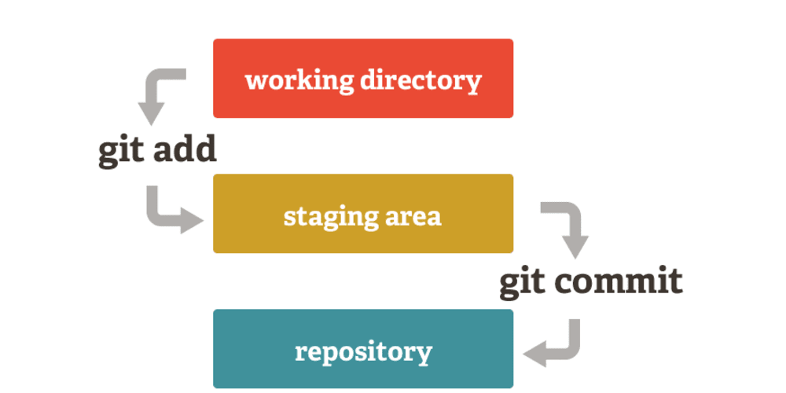

## O que é o git e github
Git é um sistema de `controle de versão de arquivos.` Através deles podemos `desenvolver projetos na qual diversas pessoas podem contribuir simultaneamente no mesmo`, editando e criando novos arquivos e permitindo que os mesmos possam existir sem o risco de suas alterações serem sobrescritas.

O Github é um serviço web que oferece diversas funcionalidades extras aplicadas ao git. Resumindo, `você poderá usar gratuitamente o github para hospedar seus projetos pessoais`. Além disso, quase todos os projetos/frameworks/bibliotecas sobre desenvolvimento open source estão no github, e você pode acompanhá-los através de novas versões, contribuir informando bugs ou até mesmo enviando código e correções

* https://tableless.com.br/tudo-que-voce-queria-saber-sobre-git-e-github-mas-tinha-vergonha-de-perguntar/

## O que é um commit?
Um Commit é `um pacote de alterações feitas no repositório`. Cada commit possui arquivos alterados, autor e uma mensagem de resumo. Agora o arquivo está pronto para ser empacotado em um commit. Escreva o comando de commit incluindo uma mensagem que explique o que sua alteração faz no repositório 

  

## O que é uma branch?
`Uma ramificação` no git é um ponteiro para as alterações feitas nos arquivos do projeto. É útil em situações nas quais você deseja adicionar um novo recurso ou corrigir um erro, gerando uma nova ramificação garantindo que o código instável não seja mesclado nos arquivos do projeto principal. Depois de concluir a atualização dos códigos da ramificação, você pode mesclar a ramificação com a principal, geralmente chamada de master. 

## Instalando o git

Windows  
> http://msysgit.github.io/

Distribuicoes baseadas no Debian 
> sudo apt-get install git

## Configurando o git
> $ git config --global user.name "Fulano da Silva" 
> $ git config --global user.email fulanodasilva.git@gmail.com

## Iniciando um repositorio git
> $ git init

## Primeiro Commmit
#### Rastrear uma alteração
> $ git add file 
> $ git add .

#### Commit
> $ git commit -m "meu primeiro commit" 
> $ git commit -am "add e commit com mensagem"

## Áreas de versionamento

#### Revertendo alterações
> $ git restore file 
> $ git restore --staged file 
> $ git checkout file 
> $ git checkout . 

#### Ver status e logs
> $ git status 
> $ git log --pretty 
> $ git log --graph

## Navegando entre os ramos
> $ git checkout -b feature 
> $ git checkout master 
> $ git checkout 951d3de 
> $ git branch
